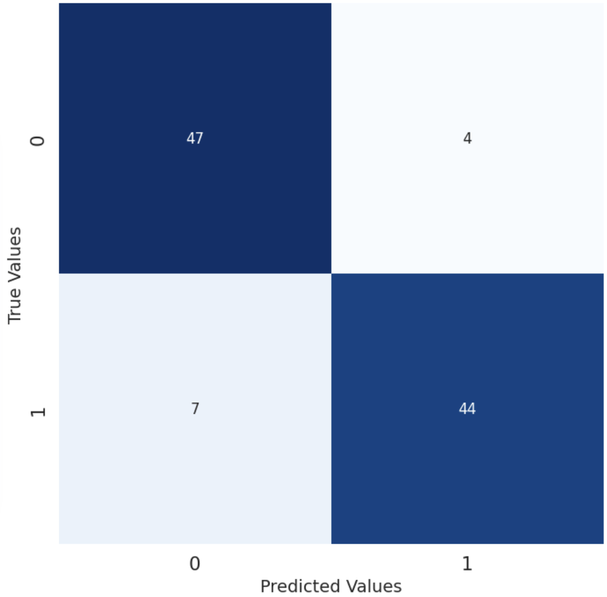
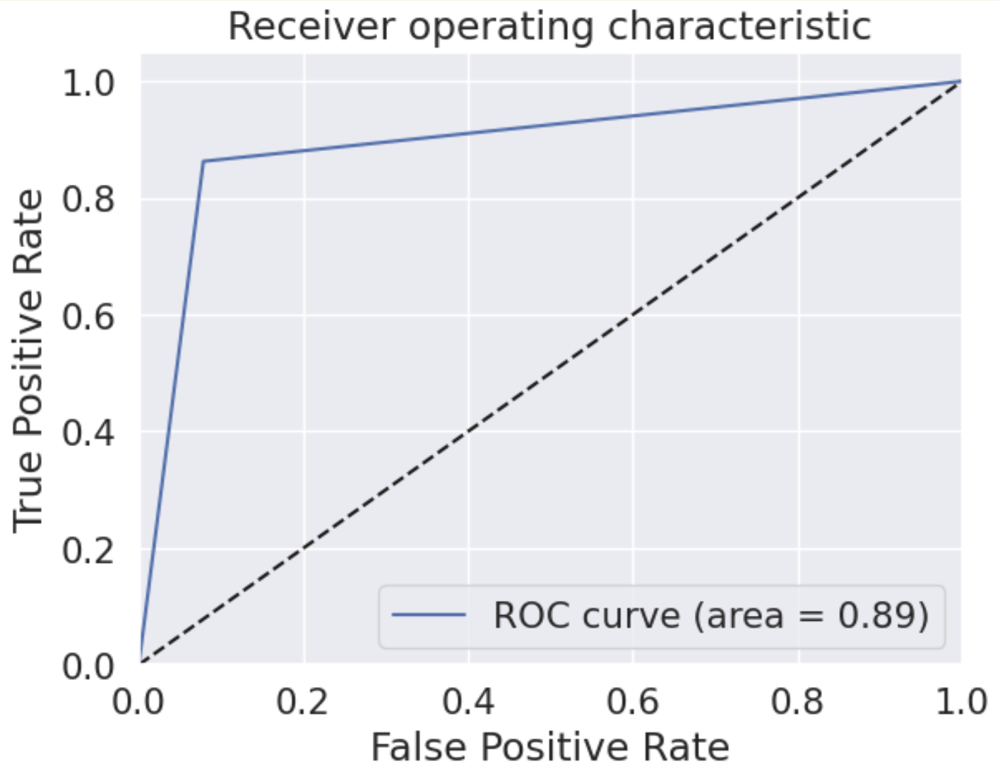

# Machine Learning for Wildlife Acoustic Monitoring
*AI-powered spectrogram analysis for automated wildlife sound detection.*

---

## Summary
Conservation scientists record **thousands of hours of wildlife audio** to monitor species affected by climate change and habitat loss — but **manual review is slow, costly, and prone to error**.  

I developed an **end-to-end machine learning pipeline** that detects animal sounds from raw audio using spectrogram-based classification.  
- **Model 1 (CNN)**: Achieved **89% accuracy**, **92% precision**, and **0.89 F1-score**  
- **Model 2 (Autoencoder)**: Proof-of-concept for anomaly detection without labeled wildlife data  
- **Impact**: Reduces manual review time by **>80%**, enabling scalable biodiversity monitoring for conservation teams  

---

## Results at a Glance

| Metric      | CNN (Model 1) | Autoencoder (Model 2) |
|-------------|--------------|-----------------------|
| **Accuracy**    | **0.89**     | 0.51                  |
| **Precision**   | **0.92**     | 0.51                  |
| **Recall**      | **0.86**     | 0.47                  |
| **F1-Score**    | **0.89**     | 0.49                  |

| Confusion Matrix (Model 1) | ROC Curve (Model 1) |
|----------------------------|--------------------|
|  |  |

---

## Technical Overview & Methodology
- **Data Source**: 6 audio datasets (646 files) from *Au Sable Forks, NY*
- **Preprocessing**:
  - Split audio into 5-second segments  
  - Converted each segment into a **spectrogram**  
  - Labeled **1,012 samples** as wildlife present (`1`) or background only (`0`)

**Example Spectrogram:**  

- **Models Implemented**:
  1. **Convolutional Neural Network (CNN)** for supervised classification
  2. **Autoencoder** trained only on background data for anomaly detection
- **Evaluation**:
  - Accuracy, Precision, Recall, F1-score  
  - Confusion Matrix & ROC Curve for detailed error analysis

---

## Future Development
- Expand to **multi-species classification**
- Integrate **diverse global datasets**
- Use **semi-supervised learning** to reduce labeling costs
- Deploy as **real-time field-ready web application**

---

## Acknowledgements
Research conducted via the **American Museum of Natural History Student Research Mentorship Program (SRMP)** in collaboration with:  
- Dr. Jemima Georges, Peter Ersts, Dr. Mary Blair  
- Co-authors: Jade Velazquez, Nico Weisberger, Daniel Lopez-Lozano  

---

## Why This Project Stands Out for Industry Applications
- **Proven Results** — Achieved 89% accuracy on real-world, noisy environmental data  
- **Full ML Lifecycle Experience** — Data preprocessing, model development, evaluation, and result interpretation  
- **Domain Impact** — Supports biodiversity conservation through scalable AI solutions  
- **Transferable Skills** — Techniques applicable to audio-based fraud detection, predictive maintenance, and environmental monitoring
